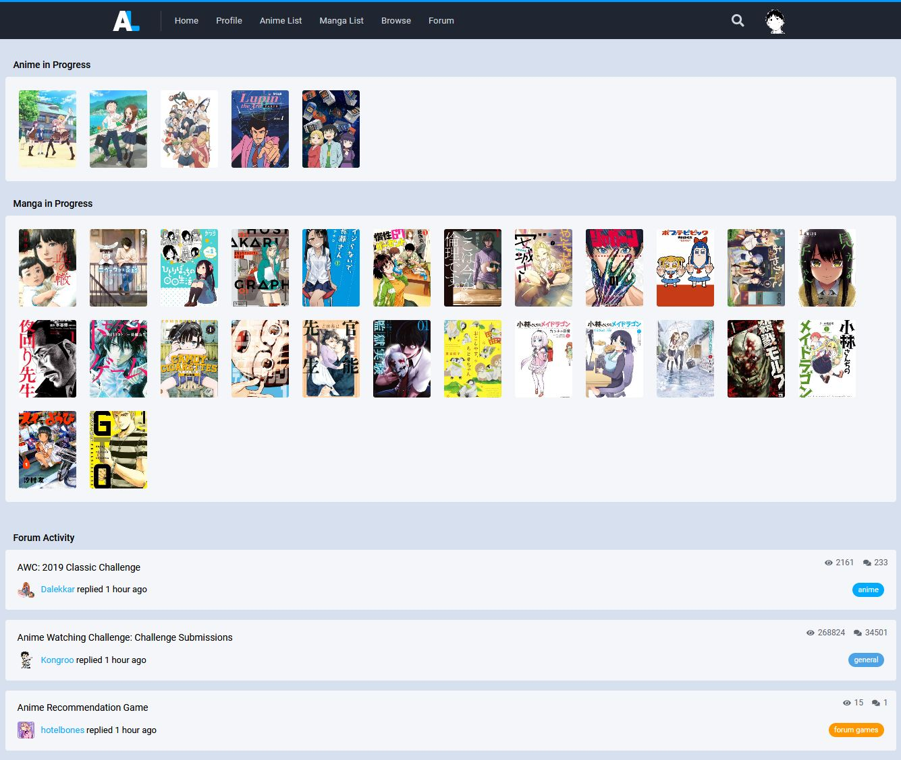

# AniList - Anti-Social

### [Click to install](https://github.com/krisu5/userstyles/raw/master/AniList%20-%20Anti-Social/anilist_anti-social.user.css)

> Also available at [Greasy Fork](https://greasyfork.org/en/scripts/397799-anilist-anti-social) and [Userstyles.org](https://userstyles.org/styles/165051/anilist-anti-social)

*Mostly simple tweaks for removing most of the social features (like the feed on front page).* 🎎

**Other screenshots:**
- 1. [Bottom of the homepage](screenshots/2_homepage_bottom.png) (no footer in the screenshot)

## Changelog

- *2020-04-06 #2:* Homepage's "Trending" and "New" sections now has better design, code prettified
- *2020-04-06 #1:* Profile activity feed fixed
- *2018-10-19:* Initial release