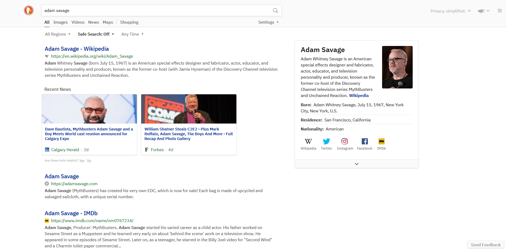

# DuckDuckGo - Wider, Prettier and Customizable

### 📦 [Click to install](https://github.com/krisu5/userstyles/raw/master/DuckDuckGo%20-%20Wider%20Prettier%20and%20Customizable/duckduckgo_wider_prettier_and_customizable.user.css)

> Also available at [Greasy Fork](https://greasyfork.org/en/scripts/397561-duckduckgo-wider-prettier-and-customizable)

*Customizable UserCSS for DuckDuckGo* 🦆

Toggleable features such as:
- IBM Plex webfont **(enabled by default)**
- Wider layout for 1920px or wider screens **(enabled by default)**
- Bigger font **(enabled by default)**
- Force hide visited link checkmark
- Delay showing sidebar in the pageload **(enabled by default)**

⚠ ***Read the notes at the bottom!***

**Other screenshots:**
1. [Wider layout disabled](screenshots/2_no_wider_layout.png)
2. [Bigger font disabled](screenshots/3_no_bigger_font.png)
3. [IBM Plex font disabled](screenshots/4_no_ibm_plex.png)
4. [All settings enabled but with DDG's official dark theme](screenshots/5_all_settings_but_with_dark_theme.png)

## Notes

- IBM Plex webfont loads externally from [jsDelivr CDN](https://www.jsdelivr.com/package/npm/@openfonts/ibm-plex-sans_all). If you want to disable the font, check the link below this.
- [How to customize settings for UserCSS style](https://github.com/openstyles/stylus/wiki/UserCSS#how-do-i-customize-usercss)
- [Recommended DDG settings](ddg_settings.md) (optional)

## Changelog

- *2020-03-12:* Add breakpoint for wide layout, move webfont to the top (so it loads bit faster), prettify the code
- *2020-03-08:* Initial release