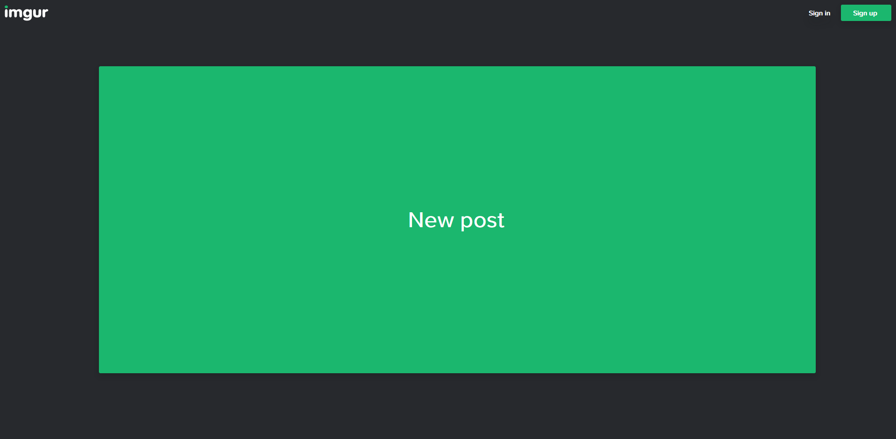

# Imgur - Minimal Design for non-Imgurians

### 📦 [Click to install](https://github.com/krisu5/userstyles/raw/master/Imgur%20-%20Minimal%20Design%20for%20non-Imgurians/imgur_-_minimal_design_for_non-imgurians.user.css)

> Also available at [Greasy Fork](https://greasyfork.org/en/scripts/398960-imgur-minimal-design-for-non-imgurians) and ~~[Userstyles.org](https://userstyles.org/styles/181729/imgur-minimal-design-for-non-imgurians)~~ 
(2020-07-17: Userstyles.org support ended)

*Removes all the unnecessary stuff, for people that's not interested about Imgur culture.* 📷

Works with old and new gallery design!

**Other screenshots:**
1. [Frontpage before](screenshots/2_frontpage_before.jpg)
2. [New gallery page after](screenshots/3_new_gallery_after.jpg)
3. [New gallery page before](screenshots/4_new_gallery_before.jpg)
4. [Old gallery page after](screenshots/5_old_gallery_after.jpg)
5. [Old gallery page before](screenshots/6_old_gallery_before.jpg)

## Changelog

- *2020-11-08:* Only show "Yes, I'm over 18" button on 18+ galleries, "Go Ad-Free" button text changed to "Support Imgur!"
- *2020-10-10:* "Explore posts" section blocked, max-height of images & videos slightly raised
- *2020-10-01:* Fixed Emerald banner related blocking on the front page
- *2020-09-25:* Added background color to "sign in" button, embed button blocked
- *2020-09-16:* Gallery image loading CSS fix, [read more here](image_loading.md)
- *2020-09-15:* Tweaked image / video sizes, image modals are now scaled to 99% of browser viewport
- *2020-07-27:* Blocks updated
- *2020-07-17:* Upload button at frontpage is now responsive
- *2020-07-12:* Added "Imgur Emerald" box on the frontpage to blocks
- *2020-06-28:* Added "disable adblock" footer box to blocks
- *2020-04-27:* Always show download button in the new gallery design
- *2020-04-17 #2:* Fixed blocks, added styling to gallery descriptions
- *2020-04-17 #1:* New blocks ("watch ad" toaster and bottom ad container)
- *2020-04-02:* Better futureproof "engagement bar" blocking (removes april fools button)
- *2020-03-30 #2:* Fix share button blocks, button text change
- *2020-03-30 #1:* Changes to frontpage's new post button, fixes to album edit pages
- *2020-03-29:* Initial release