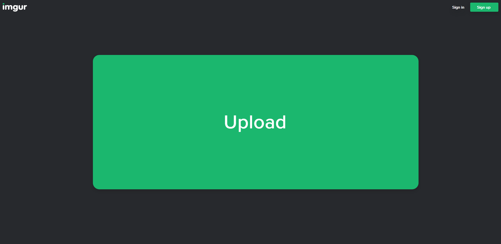

# Imgur - Minimal Design for non-Imgurians

### [Click to install](https://github.com/krisu5/userstyles/raw/master/Imgur%20-%20Minimal%20Design%20for%20non-Imgurians/imgur_-_minimal_design_for_non-imgurians.user.css)

> Also available at [Greasy Fork](https://greasyfork.org/en/scripts/398960-imgur-minimal-design-for-non-imgurians) and [Userstyles.org](https://userstyles.org/styles/181729/imgur-minimal-design-for-non-imgurians)

*Removes all the unnecessary stuff, for people that's not interested about Imgur culture.* 📷

Works with old and new gallery design!

**Other screenshots:**
1. [Frontpage before](screenshots/2_frontpage_before.jpg)
2. [New gallery page after](screenshots/3_new_gallery_after.jpg)
3. [New gallery page before](screenshots/4_new_gallery_before.jpg)
4. [Download button at the gallery page](screenshots/5_download_button.jpg)
5. [Old gallery page after](screenshots/6_old_gallery_after.jpg)
6. [Old gallery page before](screenshots/7_old_gallery_before.jpg)

## Changelog

- *2020-03-30 #2:* Fix share button blocks, button text change
- *2020-03-30 #1:* Changes to frontpage's new post button, fixes to album edit pages
- *2020-03-29:* Initial release