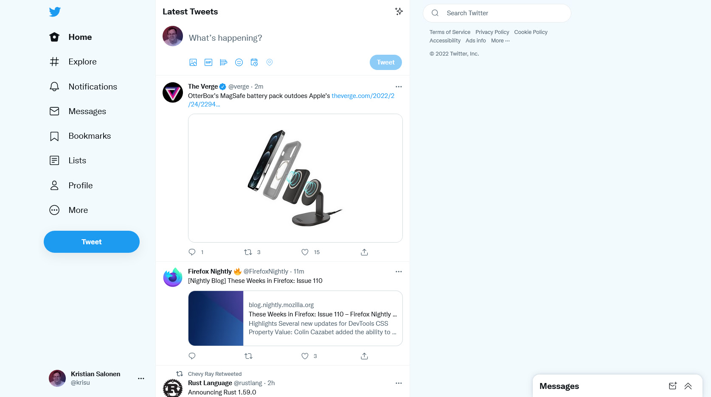

# Twitter - Clean 2019 Design (Now With Light Blue™)

### 📦 [Click to install](https://github.com/krisu5/userstyles/raw/master/Twitter%20-%20Clean%202019%20Design%20(Now%20With%20Light%20Blue)/twitter_2019_clean_design_now_with_light_blue.user.css)

> Also available at [Greasy Fork](https://greasyfork.org/en/scripts/394318-twitter-clean-2019-design-now-with-light-blue) and [Userstyles.org](https://userstyles.org/styles/173920/twitter-clean-2019-design-now-with-light-blue)

*It's same new Twitter, except much cleaner and little bit better.* 🐦

- Changes white background color to light blue *(only enabled in white theme)*
- Removes annoying elements such as trends, promoted tweets, "who to follow" boxes etc.
  - And more with **recommended uBlock filterlist!**
- Other really minor tweaks / style changes.

⚠ ***Read the notes at the bottom!***

**Other screenshots:**
- [Increase color contrast enabled](screenshots/2_increase_color_contrast_enabled.jpg)

## Notes

This userstyle can't remove everything because limitations of current CSS and complexity of layout.
So I also made uBlock filterlist that removes even more elements, that are harder to do otherwise.

**[Click here to see the filterlist](https://raw.githubusercontent.com/krisu5/userstyles/master/Twitter%20-%20Clean%202019%20Design%20(Now%20With%20Light%20Blue)/filterlist.txt)**

- First, if you haven't already, install **uBlock Origin:** [Chrome extension](https://chrome.google.com/webstore/detail/ublock-origin/cjpalhdlnbpafiamejdnhcphjbkeiagm) or [Firefox extension](https://addons.mozilla.org/en-US/firefox/addon/ublock-origin/)
  - **Uninstall Adblock Plus and other similar adblockers! Only one adblocker is necessary!** [More info here](https://twitter.com/gorhill/status/1195016403486683136)
- Then: [How to import manually a filterlist](https://github.com/gorhill/uBlock/wiki/Filter-lists-from-around-the-web)
- Also: You can copy the filter rules and add manually to uBlock Origin if you want, but you miss updates.

This userstyle and filterlist works **ONLY** with default english language (I'm not adding support for other languages). Works best with white theme, but other themes are partially supported for element blocks.

## Changelog

- *2020-06-25:* Fixed / optimized regex
- *2020-06-03:* List pages added to the whitelist
- *2020-05-27:* Events page added to the whitelist
- *2020-04-22:* Fixed moments, topics and bunch of other stuff I can't remember
- *2020-04-09:* New "empty space" block
- *2020-03-22:* Sidebar boxes blocked when "Increase color contrast" is enabled, wider toaster on settings
- *2020-03-01:* Blocked empty space in the "tweet conversation" pages
- *2020-02-26:* Related to previous fix, now targets all the tweet status URLs
- *2020-02-25:* Fixed tweet status page that has "?ref_src=" URL parameter
- *2020-02-06:* Removed the footer's negative margin, code cleanup + other minor tweaks
- *2020-01-19:* Style tweaks for search suggestions (thin custom scrollbar, bit rounder box)
- *2020-01-13:* Fix people section at "hashtag search" page
- *2020-01-11:* Add missing white BG at settings section
- *2019-09-10:* "Trending now" & "Who to follow" sidebar box blocks fixed, new element blocked
- *2019-08-26:* "Link with thumbnail" element margin fixed
- *2019-08-24:* Improved toaster alert + misc. changes that I have forgot
- *2019-08-17:* "Promote Mode" & "Twitter Ads" menu links blocked
- *2019-08-16:* Moved sidebar box blocks from filterlist to userstyle + small misc. changes
- *2019-08-10:* Moved toaster alert on the bottom little bit to the left (more center to the timeline element)
- *2019-08-06:* Twitter made changes, so one of the fixes is removed from userstyle and moved to filterlist
- *2019-08-05:* Smaller icons on the notifications page, added margin to some link elements on the tweets
- *2019-08-03 #3:* More fixes to search page
- *2019-08-03 #2:* Search page fixed (now shows accounts on "people" section), explore page fixed
- *2019-08-03 #1:* Small minor fix
- *2019-08-02:* New element blocked, code cleanup
- *2019-07-29:* "Retweeted by" and "favorited by" modals fixed
- *2019-07-28 #2:* Small border-related fix
- *2019-07-28 #1:* Initial release