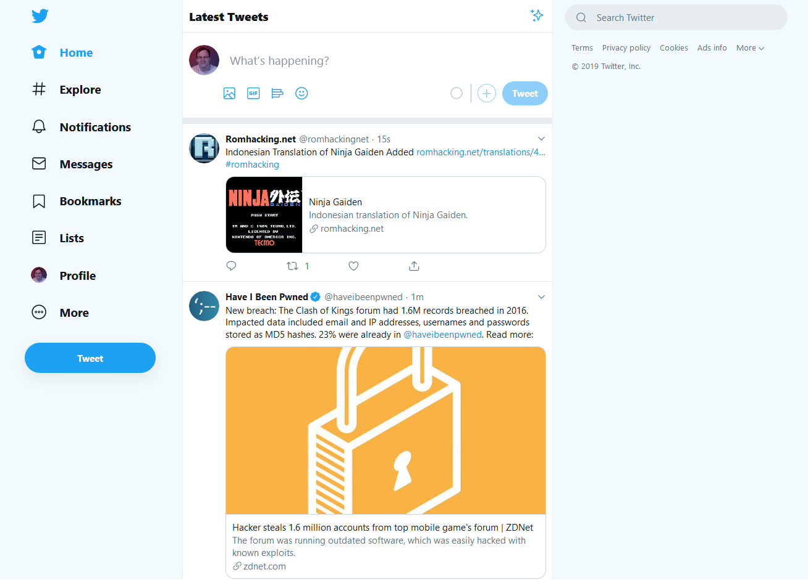

# Twitter - Clean 2019 Design (Now With Light Blue™)

### [Click to install](https://github.com/krisu5/userstyles/raw/master/Twitter%20-%20Clean%202019%20Design%20(Now%20With%20Light%20Blue)/twitter_2019_clean_design_now_with_light_blue.user.css)

*It's same new Twitter, except little bit better and much cleaner.*

Changes white background color to light blue (only enabled in white theme), removes annoying elements such as trends, promoted tweets, "who to follow" boxes (and more with recommended uBlock filterlist!) and other really minor tweaks.

## Notes

This userstyle can't remove everything because of limitations of current CSS.
So I also made uBlock filterlist that removes even more elements, that are harder to do otherwise.

**Get filterlist here:** https://pastebin.com/raw/bDE8fjGT

- First, if you haven't already, install **uBlock Origin:** Chrome extension or Firefox extension
- Then: How to import manually a filterlist
- Also: You can copy the filter rules and add manually to uBlock Origin if you want, but you miss updates.

This userstyle and filterlist works **ONLY** with default english language (I'm not adding support for other languages). Works best with white theme, but other themes are partially supported for element blocks.

## Changelog

- *2019-09-10:* "Trending now" & "Who to follow" sidebar box blocks fixed, another new element blocked
- *2019-08-26:* "Link with thumbnail" element margin fixed
- *2019-08-24:* Improved toaster alert + misc. changes that I have forgot
- *2019-08-17:* "Promote Mode" & "Twitter Ads" menu links blocked
- *2019-08-16:* Moved sidebar box blocks from filterlist to userstyle + small misc. changes
- *2019-08-10:* Moved toaster alert on the bottom little bit to the left (more center to the timeline element)
- *2019-08-06:* Twitter made changes, so one of the fixes is removed from userstyle and moved to filterlist
- *2019-08-05:* Smaller icons on the notifications page, added margin to some link elements on the tweets
- *2019-08-03 #3:* More fixes to search page
- *2019-08-03 #2:* Search page fixed (now shows accounts on "people" section), explore page fixed
- *2019-08-03 #1:* Small minor fix
- *2019-08-02:* New element blocked, code cleanup
- *2019-07-31:* Filterlist updated
- *2019-07-29:* "Retweeted by" and "favorited by" modals fixed
- *2019-07-28 #2:* Small border-related fix
- *2019-07-28 #1:* Initial release